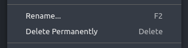
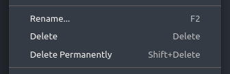

# Remote Trash

VS Code doesn't support moving files to the trash when working in a remote environment like dev containers. This extension adds a **Delete** option to the file explorer context menu that moves files to the trash using a CLI tool like `trash-cli`.

<div align="center">

**VS Code's file explorer inside a dev container:**

Without this extension:



With this extension:



</div>

## Installation

This extension requires a trash CLI tool to be installed in your dev container. The most commonly used tool is [`trash-cli`](https://github.com/andreafrancia/trash-cli).

### Manual Installation in a Running Container

To install `trash-cli` in an already running container, use `docker exec` from your host machine. Example with a Debian/Ubuntu-based container:

```bash
docker exec -it --user root <container-name> bash -c "apt-get update && apt-get install -y trash-cli && rm -rf /var/lib/apt/lists/*"
```

Replace `<container-name>` with your container's name or ID (find it with `docker ps`).

### Adding to Dev Container Configuration

To automatically install `trash-cli` when your dev container is created, add it to your `.devcontainer/devcontainer.json`:

```json
{
	"postCreateCommand": "sudo apt-get update && sudo apt-get install -y trash-cli && sudo rm -rf /var/lib/apt/lists/*",
	"customizations": {
		"vscode": {
			"extensions": ["zwyx.remotetrash"]
		}
	}
}
```

### With a Dockerfile

Add this to your `Dockerfile`:

```dockerfile
RUN apt-get update && apt-get install -y trash-cli && rm -rf /var/lib/apt/lists/*
```

## Settings

### `remotetrash.trashCliPath`

Path or command for the trash CLI executable. Defaults to `trash`.

If you're using a different trash utility or need to specify a full path, you can customize this setting.

## Limitations

### No integration with the file explorer undo stack

After deleting a file with this extension, you cannot do `Edit` → `Undo` to undo the deletion. You'll need to use the terminal with `trash-restore` (part of `trash-cli`) to restore your file. Hopefully, you'll find this still better than having lost your file permanently.

The reason is that VS Code has [separate undo stacks for the editor and the file explorer](https://code.visualstudio.com/updates/v1_52#_undo-file-operations-in-explorer), and unfortunately, extensions only get access to the editor one ([`WorkspaceEdit`](https://code.visualstudio.com/api/references/vscode-api#WorkspaceEdit), which isn't of much use for us, since deleting a file closes its editor).

### Deleting files with the keybinding (`Delete`) clears the formatting of your clipboard content

Yes, you've read correctly.

Using the clipboard as an intermediary is the only way for extensions to retrieve the list of selected files from the file explorer. There is an [open issue](https://github.com/microsoft/vscode/issues/3553#issuecomment-1098562676) about this.

When you press `Delete`, this extension saves the content of your clipboard, copy the list of selected files, retrieves it from the clipboard, and restores the original content of your clipboard. Unfortortunately, only the text is restored, any formatting is lost.

---

Because of these limitations, a [feature request](https://github.com/microsoft/vscode-remote-release/issues/11270) for a better support of the trash in dev containers has been open.
